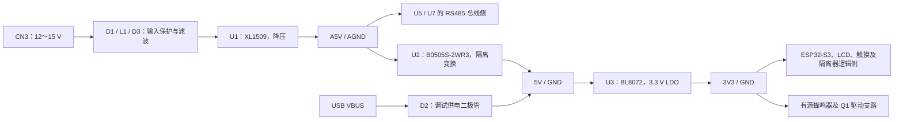

# ESP32-S3 双路隔离 RS485 与 LCD 触摸屏原理图说明

文档版本：V1.2（增加 GPIO13 有源蜂鸣器与基极下拉）  
编写日期：2026-10-04  
适用硬件：Board1 / Schematic1，2026-10-04 23:52 导出版，双路 ISO3082 与有源蜂鸣器方案。

本文说明当前电路的供电、隔离、信号连接、接口定义及固件配合要求，供硬件制作、固件开发和样机调试使用。器件位号与参数以当前工程为准；文中标为“建议”或“待验证”的内容尚未落实为硬件修改或实测结论。

项目文档总入口：[根目录 readme.md](../readme.md)。本版同步新增蜂鸣器电路：控制已改为 GPIO13，R30 基极下拉已加入；固件已加入 GPIO13 开关控制，上电关闭，网页可开/关。

## 1. 设计依据与使用条件

| 项目 | 本版采用的条件 |
| --- | --- |
| 外部供电 | CN3 输入直流 12～15 V |
| 主控 | U4：ESP32-S3-WROOM-1U；工程器件名称未写明 Flash/PSRAM 容量后缀 |
| RS485 | U5、U7 两路 ISO3082DWR，各有独立 TX、RX 和方向控制 GPIO |
| 引脚兼容方式 | CN1 的 1/2 与 3/4 两组引脚兼容同一外部设备的不同定义，由固件选择通信通道；未选引脚不带外部电源 |
| 独立串口 | U6：CA-IS3722HS，隔离逻辑电平 UART，通过 CN2 连接外部设备 |
| LCD 模块 | 中景园 ZJY350S11CTG21，ST7796S 显示驱动、GT911 电容触摸，实际接口 11 针 |
| LCD 电源与功耗 | 3.3 V；整模块功率按已确认的 0.2 W 估算，约 61 mA |
| LCD 调试预留 | H1 使用 12 针，额外第 12 针为 GPIO2/MISO 预留 |
| 蜂鸣器 | BUZZER1：HNB09A03 有源电磁式，3V3 供电，GPIO13 经 Q1 低侧驱动，R30 10 kΩ 基极下拉 |
| USB 供电 | VBUS 经 D2 接入隔离电源输出侧的 `5V`，用于临时调试 |
| 本版方案 | 已取消模拟开关；GPIO14 用于第二路 RS485 方向控制 |

主要依据：[当前原理图 PDF](PCB/SCH_Schematic1_2026-10-04.pdf)、[立创 EDA 专业版工程](PCB/ProDoc_Board1_2026-10-04.epro2)，以及 [LCD 尺寸与引脚图](LCD/3.5寸LCD尺寸和引脚.png)。PDF 共四页：第 1 页 POWER、第 2 页 ESP32S3、第 3 页隔离通信、第 4 页 LCD。

当前工程已包含 PCB 器件与网络数据。本版仅核对原理图及器件属性，未对 PCB 布局布线进行完整评审；本文不代表已完成 PCB 间距、走线、散热或 EMC 验证。

## 2. 系统结构与隔离边界

### 2.1 电源路径



此图表示供电关系，U2 输入侧和输出侧之间包含电气隔离。

### 2.2 电源和地的含义

| 网络 | 所属区域 | 主要连接 |
| --- | --- | --- |
| `VIN+`、`VIN-` | 外部电源输入 | CN3，经保护与滤波后进入降压电路 |
| `A5V`、`AGND` | 外部电源及通信侧 | U1 输出、U2 输入、U5/U7 总线侧；U6 的 GNDB 也接 AGND |
| `5V`、`GND` | 隔离后的主控侧 | U2 输出、D2 输出、U3 输入 |
| `3V3`、`GND` | 主控侧低压电源 | ESP32-S3、LCD、触摸、蜂鸣器、U5/U7 逻辑侧和 U6 的 VDDA/GNDA |
| U6 `VDDB`、`AGND` | CN2 外部串口侧 | VDDB 由 CN2 第 1 针输入，未在板上连接 A5V |

本工程的 `AGND` 表示外部电源和通信侧参考地。主控 `GND` 与 `AGND` 通过 U2、U5、U6、U7 各自的隔离结构分开，PCB 布局布线应保持这一边界。

两路 RS485 共用 A5V 和 AGND，CN2 外部串口侧也共用 AGND。因此它们与主控侧隔离，**各通信接口之间没有独立的地隔离**。USB 接入后，主控 GND 与 USB 主机地相连。

## 3. 电源电路（原理图第 1 页）

### 3.1 输入保护与 5 V 降压

CN3 第 1 针接 VIN+，第 2 针接 VIN-，输入范围按 12～15 V 使用。VIN- 经过 L1 的一组绕组进入 AGND。

| 器件 | 当前型号或数值 | 作用 |
| --- | --- | --- |
| D1 | SMF18CA，双向 TVS | 跨接 VIN+ 与 VIN-，用于抑制输入瞬态过压 |
| L1 | SMW3225S102HTE | 双线共模滤波，输入正负两根线分别通过一组绕组 |
| D3 | DSK24 | 串联在正电源路径，提供反接阻断并产生一定正向压降 |
| C1 | 10 µF / 50 V | 降压电路输入储能与滤波 |
| U1 | XL1509-5.0E1 | 固定 5 V 降压芯片，输出网络名为 A5V |
| D4 | DSK24 | 降压电路续流二极管 |
| L2 | 47 µH，FNR5040S470MT | 降压输出储能电感 |
| C7 | 220 µF / 10 V | A5V 输出滤波 |

U1 的反馈脚检测 A5V，ON/OFF 脚接 AGND，使降压电路随 VIN 上电工作。整机可用电流还受 L1、L2、二极管、温升和后级隔离电源限制，不能直接用 U1 的芯片额定电流代表整板供电能力。

### 3.2 隔离变换与 3.3 V 稳压

U2 为易川 YLPTEC 的 B0505S-2WR3，工程物料号 C5369473。输入为 A5V/AGND，输出为 5V/GND；该器件是标称 5 V、400 mA、2 W 的隔离非稳压模块，输出电压会随负载变化。[工程关联的易川器件手册](https://atta.szlcsc.com/upload/public/pdf/source/20230427/82014D73CB8555D1D44C1887F1D9A3CE.pdf)

U3 为 BL8072CLTR33，将 5V 转为 3V3。C2、C3 各 10 µF 位于 5V 侧，C4、C5 各 10 µF 和 C6 100 nF 位于 3V3 侧。U3 属于线性稳压器，电压差对应的功率主要转换为热量。

按已确认的 LCD 整模块功率估算：

```text
LCD 电流 ≈ 0.2 W ÷ 3.3 V ≈ 61 mA
U3 耗散 ≈ (5.0 V − 3.3 V) × 3V3 总负载电流
例如 3V3 总负载为 300 mA 时，U3 耗散约 0.51 W
```

U2 的 400 mA 输出经过 LDO 后，不会按 2 W ÷ 3.3 V 转换成更大的输出电流。忽略稳压器自身电流时，扣除 LCD 后约剩 339 mA。新增蜂鸣器若按器件规格中的 30 mA，加上当前 R28 支路约 7 mA 和 Q1 基极约 2.5 mA 估算，鸣叫时还需预留约 40 mA，剩余约 300 mA 给主控及其他主控侧负载。蜂鸣器在实际供电电压下的电流仍需实测；上述数值是预算，不是瞬态供电保证，应验证开机、鸣叫、无线发射及显示刷新时的压降和温升。

### 3.3 USB 临时供电

USB VBUS 经 D2 接到 U2 输出所在的 5V 网络，再通过 U3 为主控侧供电。这是本版已确认的临时调试接法。

| 供电方式 | 可供电部分 | 使用说明 |
| --- | --- | --- |
| 仅 VIN | A5V、隔离后的 5V 和 3V3 | 可进行整板功能调试；CN2 的 VDDB 仍需外部供电 |
| 仅 USB | 5V、3V3 及主控侧负载 | 用于下载、日志、LCD、触摸、按键调试；USB 经 D2 后的电压会低于 VBUS |
| VIN 与 USB 同时连接 | 两种电源同时接入当前电路 | 属于调试接线状态，本文未将其视为已经实测验证的自动电源切换功能 |

**仅 USB 供电不产生 A5V，也不向 CN2 的 VDDB 供电。** U5/U7 的总线侧缺少工作电源，不能据此测试完整 RS485 收发。D2 的单向性也不等同于对 U2 输出端增加了独立的反向隔离或电源管理。

## 4. ESP32-S3 最小系统与 USB（原理图第 2 页）

### 4.1 主控、复位与启动

U4 使用 ESP32-S3-WROOM-1U 模组，3V3 供电，C11、C12 各为 100 nF。现有固件以 N16R8（16 MB Flash、8 MB Octal PSRAM）为目标，但工程器件名只有 WROOM-1U；采购和贴装时应核对完整模组后缀。

| 电路 | 当前连接 | 行为 |
| --- | --- | --- |
| BOOT | GPIO0，R8 10 kΩ 上拉，C10 100 nF，BOOT1 接地 | 正常保持高电平；下载操作时配合复位拉低 |
| EN / RESET | R9 10 kΩ 上拉，C13 100 nF，RST1 接地 | 按下 RST1 将 EN 拉低，释放后重新启动 |
| KEY1 | GPIO41，R10 10 kΩ 上拉，C14 100 nF | 按下为低电平；固件仅查询状态，双边沿 200 ms 稳定滤波，保留备用 |
| KEY2 | GPIO40，R11 10 kΩ 上拉，C15 100 nF | 按下为低电平；固件长按 2 秒切换触摸开关，一次按住只切换一次，上电触摸默认开启 |

SW1、SW2、SW3 分别为复位、KEY1、KEY2 的并联备用按键封装，当前不加入 BOM。GPIO0、GPIO3、GPIO45、GPIO46 涉及启动配置，其中 GPIO3 已用于 LCD-DC，应保持复位期间的外部电平符合模组启动要求。[ESP32-S3 模组手册](https://www.espressif.com/sites/default/files/documentation/esp32-s3-wroom-1_wroom-1u_datasheet_en.pdf)

### 4.2 32.768 kHz 晶振

GPIO15、GPIO16 连接 X1（32.768 kHz），R2、R3 为 0 Ω，C8、C9 各为 12 pF。R1 为跨接晶振的 1 MΩ 预留电阻，当前不加入 BOM。

工程中 X1 的标称负载电容为 12.5 pF。两只 12 pF 电容对晶振形成的等效负载还包含串联等效和寄生电容，不能直接视为 12.5 pF。若启用外部低速晶振，应在样机上验证起振和频率误差；未使用时，固件不应仅因原理图存在 X1 就假定外部时钟可用。

### 4.3 USB-C

| 信号 | 当前连接 |
| --- | --- |
| D− | USB_N，经 R4 0 Ω 接 GPIO19 |
| D+ | USB_P，经 R6 0 Ω 接 GPIO20 |
| CC1、CC2 | 各通过一只 5.1 kΩ 电阻（R5、R7）下拉到 GND |
| VBUS | 经 D2 接主控侧 5V 调试电源 |
| USB 地及外壳连接 | 接主控 GND |

连接器正反插对应的 D+ 接点共网，D− 接点共网。当前电路使用 ESP32-S3 原生 USB，可用于 USB Serial/JTAG 下载和日志。R4、R6 的实际装配值是 0 Ω；固件及制作资料应保留这一事实。

### 4.4 有源蜂鸣器：GPIO13 控制

BUZZER1 的工程型号为华能 HNB09A03（C96102），有源电磁式，内含振荡驱动电路。额定电压 3 V，工程属性列出的工作电压为 1.5～4.5 V，工作电流按 30 mA 量级考虑，3V3 经 Q1 驱动适合该电压范围。图上“3kHz”是器件的声音频率标注，不是 MCU 必须提供的 PWM 频率；新旧厂家资料的频率标注存在差异，实际音调以采购版本为准。[华能 HNB09A03 厂家规格书](https://xonstorage.z8.web.core.windows.net/pdf/huaneng_hnb09a03_apr22_xonlink.pdf)

| 器件/网络 | 当前工程参数 | 连接与作用 |
| --- | --- | --- |
| BUZZER1 | HNB09A03，有源电磁式，图中标注 3 kHz | 1 脚正极接 3V3，2 脚负极接 Q1 集电极 |
| Q1 | SS8050，SOT-23 | NPN 低侧开关；工程符号 1 脚 B、2 脚 E、3 脚 C，发射极接 GND |
| R29 | 1 kΩ，1%，0.1 W | GPIO → Q1 基极的串联限流电阻 |
| R30 | 10 kΩ，1%，0.1 W | Q1 基极到发射极/GND 的下拉，建立默认关断状态 |
| R28 | 470 Ω，5%，0.1 W | 跨接蜂鸣器两端，连接 3V3 与 Q1 集电极 |
| D7 | DSK24 | 阴极接 3V3，阳极接 Q1 集电极，提供关断瞬态钳位路径 |
| C26 | 100 nF | 3V3 对 GND 的局部去耦 |
| IO13 | GPIO13 / 模组第 21 脚 | 当前蜂鸣器控制网络，经 R29 接 Q1 基极 |

最新原理图已将控制连接改为 **GPIO13**，U4 与 R29 两端的 IO13 网络一致，原 GPIO37 外接负载已移除。N16R8 的 GPIO35、GPIO36、GPIO37 连接模组内部 Octal PSRAM，应继续保留，不能分配给其他外设。[乐鑫模组手册，引脚定义注 b](https://www.espressif.com/sites/default/files/documentation/esp32-s3-wroom-1_wroom-1u_datasheet_en.pdf)

驱动逻辑如下：

| GPIO 输出 | Q1 状态 | 蜂鸣器行为 |
| --- | --- | --- |
| 低电平 | 截止 | 停止发声 |
| 高电平 | 导通 | 接通直流电源，持续发声 |
| 定时高/低切换 | 定时通断 | 形成短响、长响及间歇提示 |

有源蜂鸣器的提示节奏可用普通 GPIO 和软件定时实现，无需占用 LCD 背光使用的 LEDC timer0/channel0。固件已定义 GPIO13 并实现普通 GPIO 开关，初始化为低电平，网页直接开/关；不使用阻塞延时、PWM 音量或自动报警音，重启恢复静音。

驱动外围三只电阻的用途如下：

- **R29 为基极限流。** 以 GPIO 高电平 3.3 V、基射压降 0.8 V 估算，R29 电流约 `(3.3−0.8)/1k = 2.5 mA`，扣除 R30 电流约 0.08 mA 后，流入 Q1 基极约 2.4 mA。1 kΩ 可作为调试起点，需在实际负载下验证 Q1 导通压降，不能由三极管放大倍数直接保证饱和。
- **R28 是并联负载，不给蜂鸣器限流，也不下拉 Q1 基极。** 忽略 Q1 导通压降时，其电流约 `3.3/470 = 7.0 mA`，功率约 `3.3²/470 = 23 mW`。若没有明确的泄放或消音用途，建议先设为不装，避免额外耗电；当前仍加入 BOM。
- **R30 已提供基极下拉。** 10 kΩ 接在 Q1 基极与发射极之间，使 GPIO 复位或高阻期间基极有明确的低电平。R28 与它的作用不同。

D7 当前极性及 C26 的电源去耦连接与低侧驱动方向一致。实物还需核对所购 SS8050 的封装脚序，并在上电、复位、连续鸣叫和显示刷新同时发生时检查误鸣与电源波动。

## 5. 双路隔离 RS485（原理图第 3 页）

### 5.1 通道结构

U5 为第一路、U7 为第二路，两路均为 ISO3082DWR。逻辑侧使用 3V3/GND，总线侧使用 A5V/AGND。ISO3082 为半双工器件，额定最高数据率 200 kbit/s；常用的 9600、19200、38400、115200 bit/s 在该上限内，实际可用距离与速率仍受布线和负载影响。[TI ISO3082 数据手册](https://www.ti.com/lit/ds/symlink/iso3082.pdf)

| 功能 | 第一路：U5 | 第二路：U7 |
| --- | --- | --- |
| 固件 UART 外设 | UART1 | UART2 |
| MCU TX | GPIO17 → 485_TX1 | GPIO11 → 485_TX2 |
| MCU RX | GPIO18 ← 485_RX1 | GPIO12 ← 485_RX2 |
| 方向控制 | GPIO21 → 485_REDE1 | GPIO14 → 485_REDE2 |
| 外部 A/B | 485A1 / 485B1 | 485A2 / 485B2 |
| CN1 引脚 | 3 / 4 | 1 / 2 |

ISO3082 的 D（6 脚）接发送数据，R（3 脚）输出接收数据；A、B 分别为 12、13 脚。逻辑侧供电脚为 VCC1（1 脚），总线侧为 VCC2（16 脚）。

### 5.2 电阻、电容及保护器件

以下为工程中的**实际装配参数**，位号已经随本版更新，不沿用早期版本的编号。

| 用途 | 第一路位号 | 第二路位号 | 当前参数及连接 |
| --- | --- | --- | --- |
| TX 串联电阻 | R13 | R20 | 100 Ω，1%，0.1 W，位于 MCU TX 与 D 脚之间 |
| RX 串联电阻 | R16 | R23 | 100 Ω，1%，0.1 W，位于 R 脚与 MCU RX 之间 |
| A 线串联电阻 | R14 | R21 | 22 Ω，1%，0.1 W |
| B 线串联电阻 | R17 | R24 | 22 Ω，1%，0.1 W |
| A 线上拉 | R12 | R19 | 470 Ω，5%，0.1 W，拉到 A5V |
| B 线下拉 | R18 | R25 | 470 Ω，5%，0.1 W，拉到 AGND |
| A/B 终端电阻 | R15 | R22 | 120 Ω，5%，0.125 W，直接跨接接口侧 A/B |
| 方向控制下拉 | R26 | R27 | 10 kΩ，1%，0.1 W，接主控 GND |
| A/B 对地电容 | C16、C17 | C22、C23 | 各 1 nF，接 AGND，位于 22 Ω 电阻的收发器侧 |
| 逻辑侧去耦 | C18 | C24 | 100 nF，3V3 对 GND |
| 总线侧去耦 | C19 | C25 | 100 nF，A5V 对 AGND |
| 总线 TVS | D5 | D6 | SM712，公共端接 AGND，两者均已加入 BOM |

470 Ω 上拉、下拉为总线提供空闲偏置。22 Ω 电阻用于限制瞬态电流并抑制振铃，也会造成发送幅度损失；1 nF 电容增加了总线电容负载，因此长线和最高使用波特率需要联合验证。

R15、R22 已位于 22 Ω 串联电阻之后的接口侧。终端应按实际总线拓扑配置，通常只在物理总线两端安装；若本板位于总线中间，应调整相应终端的装配。偏置电阻也需与外部设备的偏置统一规划，避免同一物理总线重复配置过多组。[TI RS485 设计指南](https://www.ti.com/lit/an/slla272d/slla272d.pdf)

建议后续将 R15、R22 的采购规格改为 **120 Ω、1%、至少 0.25 W**，增加精度与功率余量。当前工程仍为 5%、0.125 W，本文没有把这一建议记为已修改。

### 5.3 收发方向

每路的 DE 和低有效接收使能 `/RE` 接到同一个 485_REDE 网络。

| 方向 GPIO 电平 | DE | /RE | 状态 |
| --- | --- | --- | --- |
| 0 | 关闭发送 | 开启接收 | 接收状态，驱动器不占用总线 |
| 1 | 开启发送 | 关闭接收 | 发送状态，本机不通过 R 脚接收回显 |

R26、R27 在主控 GPIO 尚未主动驱动时下拉方向节点，建立默认接收状态。固件初始化应先保证方向低电平，发送前置高，等待最后一个停止位发送完成后再置低；使用 ESP-IDF 半双工模式时，应核对 RTS 实际引脚电平与此表一致。

### 5.4 CN1：两种外部引脚定义

| CN1 针号 | 网络 | 功能 |
| --- | --- | --- |
| 1 | 485A2 | 第二路 RS485 A |
| 2 | 485B2 | 第二路 RS485 B |
| 3 | 485A1 | 第一路 RS485 A |
| 4 | 485B1 | 第一路 RS485 B |

CN1 没有电源针和独立地针。两组 A/B 可兼容同一设备的不同引脚定义：此用法下，应用按设备类型向 UART1 或 UART2 发请求，未选通道保持不发送。这里的选择由两套独立收发器实现，没有模拟开关参与。

当前固件也支持两路分别接入独立总线并行运行 Modbus；两路均初始化，独立管理方向、队列、锁及通信参数。并行运行不表示可将两套收发器并到同一物理总线同时发送。具体使用方式应与外部线束及设备连接一致。

外部线束必须满足已确认的条件：未使用的两针不带 12～15 V 电源。接线时还应按对端实际 A/B 定义核对极性，并确认外部设备与本板通信侧的参考地关系。

## 6. CN2 隔离逻辑串口（原理图第 3 页）

U6 为 CA-IS3722HS，提供两个方向相反的数字隔离通道。主控侧 VDDA 为 3V3、GNDA 为 GND；外部侧 VDDB 从 CN2 第 1 针输入，GNDB 接 AGND。C20、C21 分别为两侧的 100 nF 去耦。

| CN2 针号 | 网络/连接 | 相对本板的方向 | 外部连接 |
| --- | --- | --- | --- |
| 1 | U6 VDDB | 电源输入 | 外部设备的逻辑电源 |
| 2 | ATXD → U6 VI1 | 数据输入 | 接外部设备 TX |
| 3 | U6 VO2 → BTXD | 数据输出 | 接外部设备 RX |
| 4 | AGND | 参考地 | 接外部设备逻辑地 |

发送路径为 GPIO43 / ESP_TXD → U6 VI2（3 脚）→ VO2（6 脚）→ CN2 第 3 针。接收路径为 CN2 第 2 针 → U6 VI1（7 脚）→ VO1（2 脚）→ GPIO44 / ESP_RXD。

VDDB 的工作范围为 2.5～5.5 V，应选用与外部设备信号电平一致的电源，常见为 3.3 V 或 5 V；CN2 第 1 针不是本板向外提供的电源输出。[CA-IS3722HS 厂商资料](https://e.chipanalog.com/products/interface/digital/sdi/1085)

CN2 是逻辑电平 UART，没有 RS232 电平变换，也不是 RS485 差分口。GPIO43/44 同时是芯片默认 UART0 引脚，启动阶段可能在 GPIO43 输出 ROM 启动字节，外部协议应能忽略这些上电数据。
当前应用使用 UART0 驱动 CN2；下载及应用日志保持 USB Serial/JTAG。

## 7. LCD 与电容触摸（原理图第 4 页）

### 7.1 H1 接口

LCD 模块为 3.5 英寸 ST7796S + GT911，原生像素排列为 320 × 480；现有固件配置为 480 × 320 横屏。显示通过 SPI，触摸通过 I²C，二者共用模块 RES 复位信号。依据为 [LCD 模块资料目录](LCD/中景园ZJY350S11CTG21电容触摸技术资料-ST7796) 内的规格书及模块原理图。

| H1 针号 | 原理图网络 | MCU GPIO | 功能 |
| --- | --- | --- | --- |
| 1 | GND | — | 主控侧地 |
| 2 | 3V3 | — | 模块 3.3 V 电源 |
| 3 | LCD-SPI-SCLK | 5 | SPI 时钟 |
| 4 | LCD-SPI-MOSI | 1 | SPI 写数据 |
| 5 | LCD-RST | 10 | LCD 与 GT911 共用低有效复位 |
| 6 | LCD-DC | 3 | LCD 数据/命令选择 |
| 7 | LCD-SPI-CS | 4 | LCD 片选 |
| 8 | LCD-BL | 6 | 背光控制，可使用 PWM |
| 9 | TP-SCL | 7 | GT911 I²C 时钟 |
| 10 | TP-SDA | 8 | GT911 I²C 数据 |
| 11 | TP-INT | 9 | GT911 中断及复位阶段地址选择 |
| 12 | LCD-SPI-MISO | 2 | 调试预留；标准 11 针模块不接此针 |

H1 使用 12 针是有意预留设计。普通 11 针模块使用前 11 针，第 12 针不能直接视为模块已提供 SPI 读回信号；现有固件将 SPI MISO 配置为未使用。

### 7.2 背光与触摸初始化

模块资料中的背光由模块内部晶体管驱动，H1 第 8 针输入的是控制信号，GPIO6 不直接承担 LED 背光供电电流。控制高电平点亮，可通过 PWM 调亮度；模块内部偏置可能使背光在固件初始化前亮起，最终启动亮度以实物为准。

模块原理图包含 SCL、SDA 到 3.3 V 的上拉，模块内部数值为 4.7 kΩ。主板未单独绘制这两只上拉，替换模块时需确认新模块是否自带。

GT911 的 7 位 I²C 地址可为 `0x5D` 或 `0x14`，通过复位阶段 INT 电平选择。正常运行时 INT 用作输入中断；驱动需要先完成地址选择，再切换引脚方向。详细时序见 [GT911 手册](<LCD/中景园ZJY350S11CTG21电容触摸技术资料-ST7796/01-规格书与芯片手册/01-规格书与芯片手册/电容触控芯片GT911 Datasheet_20130319.pdf>)。

GPIO10 同时复位显示和触摸，因此启动时应协调初始化。触摸已经工作后再次拉低 LCD-RST，会同时复位 GT911；此时需重新处理触摸地址、配置与中断。现有显示驱动在首次统一硬复位后使用 LCD 软件复位，避免无意重置触摸。

## 8. GPIO 和 UART 资源总表

以下数字均为 **GPIO 编号，不是模组焊盘编号**。

| GPIO | 当前用途 | 说明 |
| --- | --- | --- |
| 0 | BOOT | 启动配置引脚 |
| 1、2 | LCD MOSI、预留 MISO | GPIO2 接 H1 第 12 针 |
| 3、4、5、6 | LCD DC、CS、SCLK、BL | GPIO3 同时涉及启动配置 |
| 7、8、9 | 触摸 SCL、SDA、INT | INT 在复位阶段还用于选择地址 |
| 10 | LCD / 触摸复位 | 两者共用 |
| 11、12、14 | 第二路 RS485 TX、RX、REDE | UART2；GPIO14 已不再空闲 |
| 13 | 有源蜂鸣器控制 | 经 R29 1 kΩ 驱动 Q1，R30 10 kΩ 下拉，固件上电 LOW、网页开关 |
| 15、16 | 32.768 kHz 晶振 | 安装并使用晶振时不再作为普通 GPIO |
| 17、18、21 | 第一路 RS485 TX、RX、REDE | UART1 |
| 19、20 | USB D−、D+ | 保留用于 USB |
| 35、36、37 | 图中未连接 | N16R8 模组内部 Octal PSRAM 使用，不能分配给其他外设 |
| 38、39、42 | 图中未连接 | 扩展候选；使用调试接口时需核对复用关系 |
| 40 | KEY2，触摸开关 | 低有效，30 ms 消抖，稳定按下后长按 2 秒切换一次；上电默认触摸开启 |
| 41 | KEY1，保留输入 | 低有效，按下/松开各稳定 200 ms 才更新状态，无业务动作 |
| 43、44 | CN2 串口 TX、RX | 应用使用 UART0；控制台不占用业务 UART |
| 45、46 | 图中未连接 | 启动配置相关，扩展前核对上电电平 |
| 47、48 | 图中未连接 | 扩展候选，需按实际模组完整型号核对可用性及电压域 |

### 8.1 当前固件资源分配

硬件连线决定使用哪些 GPIO，UART0/1/2 外设编号由固件配置。当前 [固件说明](../fireware/README.md)、[引脚定义](../fireware/components/board_drivers/include/board_pins.h)、[RS485 驱动](../fireware/components/board_drivers/rs485.c) 和 [CN2 串口驱动](../fireware/components/board_drivers/serial_port.c) 已对应下表：

| 功能 | 当前固件分配 | 运行方式 |
| --- | --- | --- |
| RS485 第一路 | UART1，GPIO17/18/21 | 充电器 1 独立任务；通用 Modbus API 保留 |
| RS485 第二路 | UART2，GPIO11/12/14 | 充电器 2 独立任务，与第一路并行 |
| CN2 隔离串口 | **UART0**，GPIO43/44 | 独立收发，默认 115200、8N1 |
| 下载与日志 | USB Serial/JTAG | 继续使用 USB，避免占用业务 UART |

两路 485 各自持有事件队列、事务锁、帧间隔及串口配置；一路超时不会阻塞另一条总线。
默认均初始化且不自动发送，配置双路只读示例后，各自创建一个任务轮询独立配置的从站。
具体通信参数必须与各自设备一致；实机并行收发尚待样机验证。

当前 `fireware` 使用 ESP-IDF 6.1，项目依赖已完整内置，旧参考代码目录可删除。
具体 GPIO、触摸芯片、UART 分配以本版电路与实际固件为准；源码来源与工具依赖见
[固件依赖说明](../fireware/DEPENDENCIES.md)。

GPIO40 的触摸开关仅屏蔽输入，不复位 GT911、不关闭 LCD；关闭期间继续读取和清除触摸帧。
重新开启前丢弃挂起帧，已按住屏幕的手指需松开再开始新手势，避免旧触点重放；重启恢复开启。
GPIO41 只读取滤波后的按键状态，不产生业务动作或长按事件。

GPIO13 蜂鸣器已接入固件，默认静音，接口为 `buzzer_init/set/is_on`。充电控制、网页和网络已移植到 `fireware/components/charger`；两路分别控制独立充电器，运行设定每 15 秒写入，开关机与保护立即执行。实体旧屏幕 UI 和 EC11 暂不移植，LCD 保留 LVGL benchmark。详见 [充电控制说明](../fireware/CHARGER.md)。

## 9. 装配状态与尚待验证项目

### 9.1 工程装配标记

| 器件 | 当前工程状态 | 制作含义 |
| --- | --- | --- |
| D5、D6 | 加入 BOM | 两路 SM712 均进入物料清单 |
| R26、R27 | 加入 BOM，10 kΩ | 两路方向控制下拉已落实 |
| R15、R22 | 加入 BOM，120 Ω / 5% / 0.125 W | 接口侧终端，是否装配取决于总线位置 |
| BUZZER1、Q1、D7、C26、R28、R29、R30 | 均加入 BOM | 新增蜂鸣器支路，GPIO13 及基极下拉已落实；R28 不装仍为后续建议 |
| R1 | 不加入 BOM | 1 MΩ 晶振跨接电阻作为预留 |
| SW1、SW2、SW3 | 不加入 BOM | 备用按键封装 |
| H1 | 不加入 BOM | 需在人工采购/装配安排中明确 12 针排母；该标记不改变接口的设计用途 |

“不加入 BOM”是当前工程导出属性，不自动代表实物永不安装；尤其 H1 是正常使用 LCD 所需的连接位置。

### 9.2 建议与验证范围

| 项目 | 当前事实 | 后续工作 |
| --- | --- | --- |
| 蜂鸣器固件 | GPIO13 默认关闭及网页开关已实现 | 上板确认上电静音、电平与驱动电流 |
| 蜂鸣器关断与功耗 | R30 10 kΩ 基极下拉已加入，R28 470 Ω 仍并联蜂鸣器 | 无明确泄放用途时 R28 可不装；实测上电静音、驱动压降及支路电流 |
| 终端电阻规格 | R15/R22 仍为 5%、0.125 W | 建议选 1%、至少 0.25 W，并按总线两端配置装配 |
| 完整主控型号 | 硬件名称未标容量后缀，固件目标 N16R8 | 采购前统一型号与 Flash/PSRAM 配置 |
| 双路串口软件 | 已实现 UART1/UART2 双路 Modbus、CN2 UART0，编译与主机测试通过 | 按第 8 节配置两台从站，实测并行收发及一路断线时的独立性 |
| 隔离电源余量 | U2 标称 400 mA；LCD 约 61 mA，当前蜂鸣器支路鸣叫时再预算约 40 mA | 测试最重负载下的启动、3V3 压降及 U3 温升 |
| EN 复位时序 | R9 10 kΩ、C13 100 nF | 验证慢上电、快速断电重启和负载突变下的可靠启动 |
| 外部低速晶振 | X1 标称负载 12.5 pF，C8/C9 各 12 pF | 若启用，验证起振与频偏后确定电容参数 |
| PCB 实现 | 工程已含器件与网络数据，本轮未完整评审布局布线 | 检查隔离边界、供电回路、接口保护器件位置、USB、晶振及蜂鸣器电流回路 |

上述内容是文档编写时的待办状态，不是实测失败记录。USB 接入隔离输出侧及 H1 额外预留 MISO 已按设计意图记录，不列为连接错误。

## 10. 样机上电与调试顺序

1. **断电检查。** 核对实板蜂鸣器接 GPIO13、R30 接在 Q1 基极与发射极之间。核对 CN3 极性、二极管方向、U2 引脚、主控型号及实际装配；检查电源对地短路，确认主控 GND 与 AGND 没有非设计连接。
2. **单独验证 VIN 供电。** 使用有电流限制的 12 V 电源接 CN3。相对 AGND 测量 A5V；相对主控 GND 测量 5V 和 3V3。记录轻载、正常负载及启动时的电压。
3. **USB 下载与日志。** 按需要验证 USB 单独临时供电，检查枚举和下载。USB 单供电阶段只验证主控侧功能。
4. **按键、LCD 与触摸。** 完成 GPIO10 共用复位及 GT911 地址选择，检查横屏、背光与触摸坐标。KEY2/GPIO40 长按 2 秒开关触摸，保持按住只触发一次，重启默认开启；KEY1/GPIO41 仅在电平稳定 200 ms 后更新状态。关闭及重新开启触摸时按住屏幕，检查旧手势不会误触发。
5. **CN2 串口。** 向 CN2 第 1 针提供与外部 UART 一致的逻辑电源，第 4 针接外部逻辑地；对端 TX 接第 2 针、RX 接第 3 针。核对上电字节及双向通信。
6. **RS485 第一路。** 保持 VIN 供电，使用 CN1 第 3/4 针，核对终端配置、A/B 极性和 GPIO21 收发切换，先以较低波特率完成通信。
7. **RS485 第二路及并行测试。** 使用 CN1 第 1/2 针，验证 GPIO14 默认接收及发送结束回到接收。分别接入两条独立总线后运行双路只读示例，拔掉一路应仅使该路超时，另一路继续通信；仅使用兼容线束时确认选择正确的通道。
8. **蜂鸣器。** 烧录 GPIO13 控制固件后，先保持输出低，检查上电和复位时是否静音，再测试短响、长响及停止；测量 Q1 导通压降、支路电流与 3V3 波动。
9. **整机负载测试。** 在实际线缆、目标波特率、显示刷新、蜂鸣器鸣叫及无线功能等实际负载下，检查误码、复位、3V3 瞬态和电源温升。

跨隔离边界测量时，应核对仪器各通道地夹是否共地，避免测量接线把 GND 与 AGND 短接。此处给出调试步骤，未预填任何样机测试结果。

## 11. 文件与资料索引

| 资料 | 用途 |
| --- | --- |
| [原理图 PDF](PCB/SCH_Schematic1_2026-10-04.pdf) | 四页电路连接、信号网络、接口引脚 |
| [EDA 专业版工程](PCB/ProDoc_Board1_2026-10-04.epro2) | 器件属性、BOM 标记、实际参数及工程编辑 |
| [LCD 引脚图](LCD/3.5寸LCD尺寸和引脚.png) | 模块尺寸和接口位置 |
| [LCD 模块原理图压缩包](LCD/中景园ZJY350S11CTG21电容触摸技术资料-ST7796/02-原理图.zip) | 共用复位、背光驱动、模块内 I²C 上拉 |
| [LCD 芯片与模组资料目录](LCD/中景园ZJY350S11CTG21电容触摸技术资料-ST7796/01-规格书与芯片手册/01-规格书与芯片手册) | ST7796S、GT911 和屏幕规格书 |
| [现有固件](../fireware/README.md) | 当前软件配置、驱动接口与构建方法 |
| [固件依赖清单](../fireware/DEPENDENCIES.md) | 已内置源码、资源、许可及独立构建方法，无需旧参考目录 |
| [项目文档总入口](../readme.md) | 全部正式文档的索引与维护规则 |

为区分同名文件的再次导出，本版文档核对的源文件 SHA-256 如下：

```text
SCH_Schematic1_2026-10-04.pdf
6d988b33f0d29e5ac5473c03b552005e6d200fcd27e2aa649493e39553dc1181

ProDoc_Board1_2026-10-04.epro2
423db2c4a826e2c275666e31198c6bc53c08a92acbb3958e29e164440aad8acc
```

后续若更改位号、GPIO、终端规格、供电路径或 UART 分配，应同步更新本文对应表格与源文件版本。
